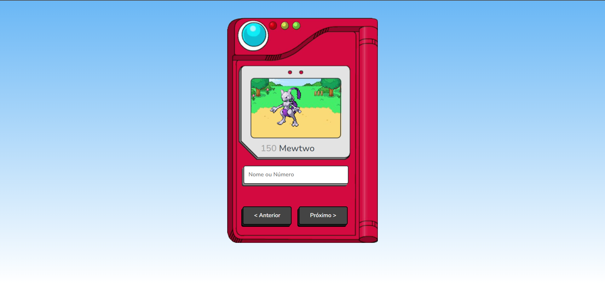

<!DOCTYPE html>
<html lang="pt-br">
    <head>
      <h1>Desafio Pokedex:</h1>

 <link rel="stylesheet" href="https://cdn.jsdelivr.net/npm/bootstrap@4.3.1/dist/css/bootstrap.min.css" integrity="sha384-ggOyR0iXCbMQv3Xipma34MD+dH/1fQ784/j6cY/iJTQUOhcWr7x9JvoRxT2MZw1T" crossorigin="anonymous">
</head>

<body>
    

        
    

</body>
</html>
